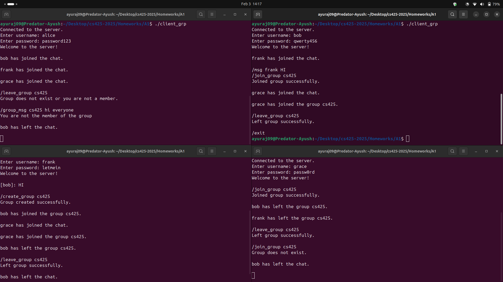

# CS425 Assignment 1

This is a simple server implementation in C++ that allows users to log in, send broadcast messages, private messages, and manage groups. Clients can connect to the server, perform various actions, and interact with other clients based on their session and group memberships.

## Features

### 1. User Authentication
- Users listed in the `user.txt` file can log in as clients once the server starts.
- If a user tries to log in from multiple sessions, the server will respond with:
  - **"You are already logged in from another session."**

### 2. Broadcasting Messages
- Clients can broadcast a message to all others using the `/broadcast {message}` command.
- If the message is empty, it will show an error:
  - **"Error: Broadcast message cannot be empty."**
- Otherwise, the message will be broadcast to all clients in the format:
  - `alice : {message}`

### 3. Private Messages
- Clients can send private messages using the `/msg <name> <msg>` command.
- If the recipient's name or the message is empty, it will show:
  - **"Error: Recipient and message required."**
- Otherwise, the message will be sent to the specified recipient.

### 4. Group Management

#### Create Group
- Clients can create groups with the `/create_group <group name>` command.
- If the group name is empty:
  - **"Error: Group name cannot be empty."**
- If the group already exists:
  - **"Error: Group already exists."**
- Otherwise, the group will be created successfully.

#### Join Group
- Clients can join a group with the `/join_group <group name>` command.
- If the group name is empty:
  - **"Error: Group name cannot be empty."**
- If the group doesn't exist:
  - **"Error: Group does not exist."**
- If the client is already a member:
  - **"Error: You are already in this group."**
- Otherwise, the client will join the group and all members will receive a notification:
  - `"<person> has joined the group <group name>."`

#### Leave Group
- Clients can leave a group with the `/leave_group <group name>` command.
- If the group name is empty:
  - **"Error: Unknown command"**
- If the client successfully leaves the group:
  - **"You have left the group successfully."**
  - A notification will be sent to all group members:
    - `"<person> left the group <group name>."`
- If all members leave the group, the group will be deleted automatically.

### 5. Unknown Commands
- If a user tries to enter any unknown command, the server will respond with:
  - **"Error: Unknown command."**

# Important Functions and Their Definition

## 1. `load_users`
This function loads user credentials from a file into an unordered map.  
It reads a file line by line, splits each line into a username and password, and stores them in the `users` map for authentication purposes.

## 2. `send_message`
This function sends a message to a specific client via its socket.  
It takes the client socket and the message to send and sends it using the `send()` system call.

## 3. `broadcast_message`
This function sends a message to all connected clients except the sender.  
It iterates through the `clients` map, excluding the sender's socket, and sends the message to all other clients.

## 4. `group_broadcast`
This function broadcasts a message to all members of a specific group.  
It checks the group’s membership and sends the message to each member, excluding the sender.

## 5. `private_message`
This function sends a private message to a specific recipient.  
It checks if the recipient is connected, then sends the message to that client's socket. If the recipient is not found, an error message is sent to the sender.

## 6. `group_message`
This function sends a message to all members of a group.  
It verifies the group’s existence and the sender’s membership, then sends the message to all group members.

## 7. `handle_client`
This function handles the entire client interaction, including authentication and command processing.  
It prompts for a username and password, authenticates the user, and processes various commands like broadcasting, private messaging, group creation, joining, and leaving, while maintaining client-session integrity.

## 8. `main`
This function initializes the server, sets up the socket, and waits for incoming client connections.  
It listens on the specified port, accepts incoming connections, and spawns a new thread to handle each connected client.

## Thread vs Process Decision

### Decision:
Threads were chosen over processes for handling client connections.

### Reason:
- **Efficiency**: Threads are lightweight compared to processes, using less memory and resources. This makes it easier to scale the server to handle many simultaneous client connections without significant overhead.
- **Shared Resources**: Threads in the same process share memory, making communication and synchronization between threads more efficient than processes, which require inter-process communication (IPC).
- **Simplified Resource Management**: Since threads share the same memory space, it reduces the complexity of resource management compared to processes, where each process has its own memory space.
- **Faster Context Switching**: Context switching between threads is generally faster than between processes, resulting in better performance in high-concurrency situations.

Thus, threads provide a more efficient, resource-friendly solution for handling multiple client connections simultaneously.

## Use of Mutexes Decision

### Decision:
Mutexes were used to ensure thread-safe access to shared resources (`clients` and `groups` maps).

### Reason:
- **Avoid Race Conditions**: Since multiple threads may modify shared data structures (e.g., adding/removing clients, managing groups), mutexes are essential to prevent race conditions, where threads could access or modify data simultaneously, leading to inconsistencies.
- **Thread Safety**: Mutexes provide exclusive access to critical sections of the code, ensuring that only one thread at a time can modify shared resources. This guarantees the integrity of data and prevents conflicts.
- **Scalability**: By using mutexes, the server can efficiently scale to handle more clients without risking data corruption or unexpected behavior due to concurrent access.
- **Deadlock Prevention**: Proper use of mutexes ensures synchronization while minimizing the risk of deadlocks by controlling how threads interact with shared resources.

Mutexes provide a straightforward and effective mechanism to synchronize threads and maintain data consistency in a multi-threaded server environment.

### Correctness

I have tested the server implementation by joining with different clients from separate servers. All the basic functionalities specified in the assignment were thoroughly checked, including:
- User authentication
- Sending and receiving broadcast messages
- Sending and receiving private messages
- Group creation, joining, and leaving
- Error handling for invalid commands

The system worked as expected, and all the commands performed correctly across multiple clients.

When a person joins or leaves a group, a notification is sent to all the members in the group.

### Limitations

- **No Persistence**: User data and sessions are lost after the server restarts.
- **Resource Dependent**: The number of users is limited by system resources (memory, CPU, etc.).

### Challenges

- **Empty Message Issue**: The server would disconnect when an empty message was sent. This was handled by adding a check to ensure the message was not empty before processing.
  
- **Multiple Session Issue**: A user logging in from multiple sessions caused inconsistency—both sessions could send messages, but only one received them.  
- **Fix**: Implemented a check using a mutex lock to ensure a user can only be logged in from one session at a time. If already logged in, the new session is denied access.

### Contribution

I have completed the entire assignment on my own.
[GithubLink](https://github.com/ayuraj09/CS425_Socket_Programming)

### Sources

- **C++ Documentation**: [Referenced for standard libraries and best practices](https://en.cppreference.com/w/cpp/23).
- **Assignment Hints**: Followed the provided hints for implementation.
- **Threading & Synchronization**: Used [C++ std::thread and std::mutex documentation](https://en.cppreference.com/w/cpp/thread).
- **Socket Programming in C++**: [GeeksforGeeks Tutorial](https://www.geeksforgeeks.org/socket-programming-in-cpp/).
- **Multithreading in C++**: [GeeksforGeeks Tutorial](https://www.geeksforgeeks.org/multithreading-in-cpp/).
- **C++ Socket Programming**: [TutorialsPoint Guide](https://www.tutorialspoint.com/cplusplus/cpp_socket_programming.htm).
 
# Declaration & Feedback

## Declaration  
- The entire work, including server implementation and functionalities, was originally done by me.  
- All code, logic, and design were developed independently to meet the assignment requirements.  

## Feedback  
- It was interesting to see multiple clients interact in real-time.  
- Managing sessions and handling concurrency was a great learning experience.  
- The assignment was a valuable exercise in network programming and multi-threading.  
